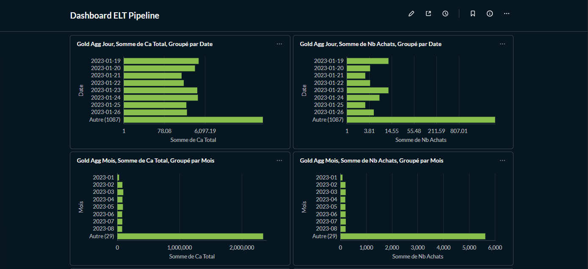
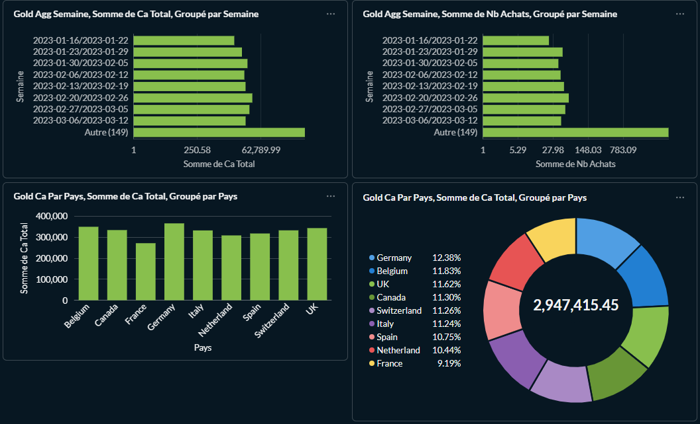
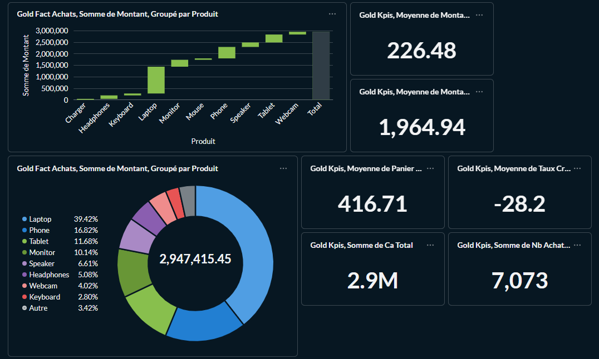

# Pipeline ELT - Documentation

**Repository GitHub :** [https://github.com/AurelienAllenic/pipeline-elt-iim](https://github.com/AurelienAllenic/pipeline-elt-iim)

## Installation

### 1. Créer l'environnement virtuel

```bash
python -m venv venv
```

### 2. Activer l'environnement virtuel

**Windows (PowerShell):**
```bash
.\venv\Scripts\Activate.ps1
```

**Windows (CMD):**
```bash
venv\Scripts\activate.bat
```

**Linux/Mac:**
```bash
source venv/bin/activate
```

### 3. Installer les dépendances

```bash
pip install -r requirements.txt
```

### 4. Démarrer les services Docker

```bash
docker-compose up -d
```

Cela démarre :
- MinIO (stockage objet)
- PostgreSQL (base de données Prefect)
- Prefect Server (orchestration)
- Metabase (Business Intelligence)
- PostgreSQL pour Metabase (métadonnées)

### 5. Configuration

Créer un fichier `.env` à la racine du projet avec :

```
PREFECT_API_URL=http://localhost:4200/api
MINIO_ENDPOINT=localhost:9000
MINIO_ACCESS_KEY=minioadmin
MINIO_SECRET_KEY=minioadmin
MINIO_SECURE=False
MONGODB_URI=mongodb+srv://<username>:<password>@<cluster>.mongodb.net/?retryWrites=true&w=majority
MONGODB_DATABASE=analytics
MONGODB_COLLECTION_PREFIX=gold_
API_URL=http://localhost:8000
```

## Génération des données

Pour générer des données de test :

```bash
python script/generate_data.py
```

Cela crée les fichiers `clients.csv` et `achats.csv` dans `data/sources/`.

## Exécution du pipeline

### Option 1 : Lancer tout le pipeline puis le dashboard

```bash
python run_all.py
```

Cette commande :
1. Exécute le pipeline complet (Bronze → Silver → Gold → MongoDB)
2. Propose de lancer l'API FastAPI (optionnel)
3. Si l'API est lancée, calcule automatiquement le temps de refresh entre l'écriture dans MongoDB et la disponibilité via l'API
4. Propose de lancer le dashboard automatiquement (nécessite l'API)

### Option 2 : Lancer uniquement l'orchestrateur

```bash
python flows/orchestrate_pipeline.py
```

Exécute les trois couches dans l'ordre + la base : Bronze → Silver → Gold -> MongoDB

### Option 3 : Lancer les couches séparément

**Couche Bronze :**
```bash
python flows/bronze_ingestion.py
```

**Couche Silver :**
```bash
python flows/silver_transformation.py
```

**Couche Gold :**
```bash
python flows/gold_agregation.py
```

**MongoDB :**
```bash
python flows/gold_to_mongodb.py
```

### Option 4 : Lancer l'API FastAPI

```bash
python api.py
```

Ou avec uvicorn directement :

```bash
uvicorn api:app --reload --port 8000
```

L'API expose les données MongoDB via des endpoints REST. Elle doit être lancée avant le dashboard.

### Option 5 : Lancer uniquement le dashboard

```bash
streamlit run dashboard.py
```

## URLs disponibles

### Prefect UI
- URL : http://localhost:4200
- Description : Interface pour visualiser les exécutions des flows, les logs et les métriques

### MinIO Console
- URL : http://localhost:9001
- Identifiants : minioadmin / minioadmin
- Description : Interface pour gérer les buckets et visualiser les fichiers stockés

### API FastAPI
- URL : http://localhost:8000
- Documentation interactive : http://localhost:8000/docs
- Description : API REST qui expose les données MongoDB. Le dashboard Streamlit interroge cette API pour afficher les données.
- Endpoints disponibles : `/kpis`, `/fact_achats`, `/dim_clients`, `/dim_produits`, `/dim_dates`, `/agg_jour`, `/agg_semaine`, `/agg_mois`, `/ca_par_pays`, `/refresh_time/{collection_name}`

### Dashboard Streamlit
- URL : http://localhost:8501
- Description : Dashboard interactif pour visualiser les données. Interroge l'API FastAPI pour récupérer les données depuis MongoDB.

### Metabase
- URL : http://localhost:3000
- Description : Outil de Business Intelligence pour créer des dashboards et des requêtes sur les données MongoDB
- Configuration :
  1. Au premier lancement, créez un compte administrateur
  2. Ajoutez une base de données MongoDB :
     - Aller dans "Admin" > "Databases" > "Add database"
     - Sélectionner "MongoDB"
     - Utiliser votre `MONGODB_URI` du fichier `.env` comme **Connection String**
     - Ou remplir manuellement :
       - **Host** : Votre cluster MongoDB (ex: cluster.mongodb.net)
       - **Port** : 27017 (ou laissez vide pour MongoDB Atlas)
       - **Database name** : `analytics`
       - **User** : Votre username MongoDB
       - **Password** : Votre password MongoDB
  3. Les collections MongoDB apparaîtront comme des tables :
     - `gold_fact_achats`, `gold_kpis`, `gold_dim_clients`, `gold_dim_produits`, `gold_dim_dates`, `gold_agg_jour`, `gold_agg_semaine`, `gold_agg_mois`, `gold_ca_par_pays`
  4. Créez des questions (requêtes) et regroupez-les dans des dashboards

#### Contenu du Dashboard Metabase

Le dashboard "Dashboard ELT Pipeline" contient les visualisations suivantes :

**Partie 1** :

- KPIs Principaux : CA Total, Nombre d'achats, Panier moyen, Croissance mensuelle, Clients uniques, Montant moyen par client, Montant médian
- Évolution temporelle du CA et du nombre d'achats

**Partie 2** :

- Analyses par produit : CA par produit, répartition du CA par produit
- Analyses par pays : CA par pays, répartition du CA par pays

**Partie 3** :

- Agrégations temporelles supplémentaires : CA et nombre d'achats par semaine et par mois

## Structure du pipeline

### Couche Bronze
- Source : `data/sources/`
- Destination : Bucket MinIO `bronze`
- Actions : Upload des fichiers sources, copie vers bronze

### Couche Silver
- Source : Bucket MinIO `bronze`
- Destination : Bucket MinIO `silver`
- Actions : Nettoyage, standardisation des dates, normalisation des types, déduplication

### Couche Gold
- Source : Bucket MinIO `silver`
- Destination : Bucket MinIO `gold`
- Actions : Calcul des KPIs, création des tables de dimensions, agrégations temporelles, CA par pays

### Export MongoDB
- Source : Bucket MinIO `gold`
- Destination : MongoDB Atlas (ou MongoDB local)
- Actions : Lecture des fichiers CSV/Parquet depuis Gold, écriture dans les collections MongoDB
- Collections créées : `gold_fact_achats`, `gold_kpis`, `gold_dim_clients`, `gold_dim_produits`, `gold_dim_dates`, `gold_agg_jour`, `gold_agg_semaine`, `gold_agg_mois`, `gold_ca_par_pays`

### API FastAPI
- Source : MongoDB (collections créées par l'export)
- Destination : Endpoints REST accessibles via HTTP
- Actions : Expose les données MongoDB via une API REST. Le dashboard Streamlit interroge cette API pour récupérer et afficher les données.
- Endpoints disponibles : `/kpis`, `/fact_achats`, `/dim_clients`, `/dim_produits`, `/dim_dates`, `/agg_jour`, `/agg_semaine`, `/agg_mois`, `/ca_par_pays`, `/refresh_time/{collection_name}`

### Calcul du temps de refresh
- **Quand** : Automatiquement après le lancement de l'API via `run_all.py`
- **Objectif** : Mesurer le temps entre l'écriture des données dans MongoDB et leur disponibilité via l'API FastAPI
- **Méthode** : 
  - Les timestamps d'écriture sont enregistrés dans MongoDB lors de l'export (collection `_refresh_metadata`)
  - L'endpoint `/refresh_time/{collection_name}` calcule la différence entre le timestamp d'écriture et le timestamp de lecture
  - Le script `test_refresh_time.py` teste plusieurs collections et calcule les statistiques (moyen, minimum, maximum)
- **Utilisation manuelle** : 
  ```bash
  python test_refresh_time.py
  ```
  (nécessite que l'API soit lancée)

## Fichiers générés dans Gold

- `fact_achats.csv` : Table de faits (achats + clients)
- `kpis.csv` : Indicateurs clés de performance
- `dim_clients.csv` : Dimension clients
- `dim_produits.csv` : Dimension produits
- `dim_dates.csv` : Dimension dates
- `agg_jour.csv` : Agrégations par jour
- `agg_semaine.csv` : Agrégations par semaine
- `agg_mois.csv` : Agrégations par mois
- `ca_par_pays.csv` : Chiffre d'affaires par pays

## Collections MongoDB créées

- `gold_fact_achats` : Table de faits (achats + clients)
- `gold_kpis` : Indicateurs clés de performance
- `gold_dim_clients` : Dimension clients
- `gold_dim_produits` : Dimension produits
- `gold_dim_dates` : Dimension dates
- `gold_agg_jour` : Agrégations par jour
- `gold_agg_semaine` : Agrégations par semaine
- `gold_agg_mois` : Agrégations par mois
- `gold_ca_par_pays` : Chiffre d'affaires par pays

## Arrêter les services Docker

```bash
docker-compose down
```

Pour arrêter et supprimer les volumes :

```bash
docker-compose down -v
```
